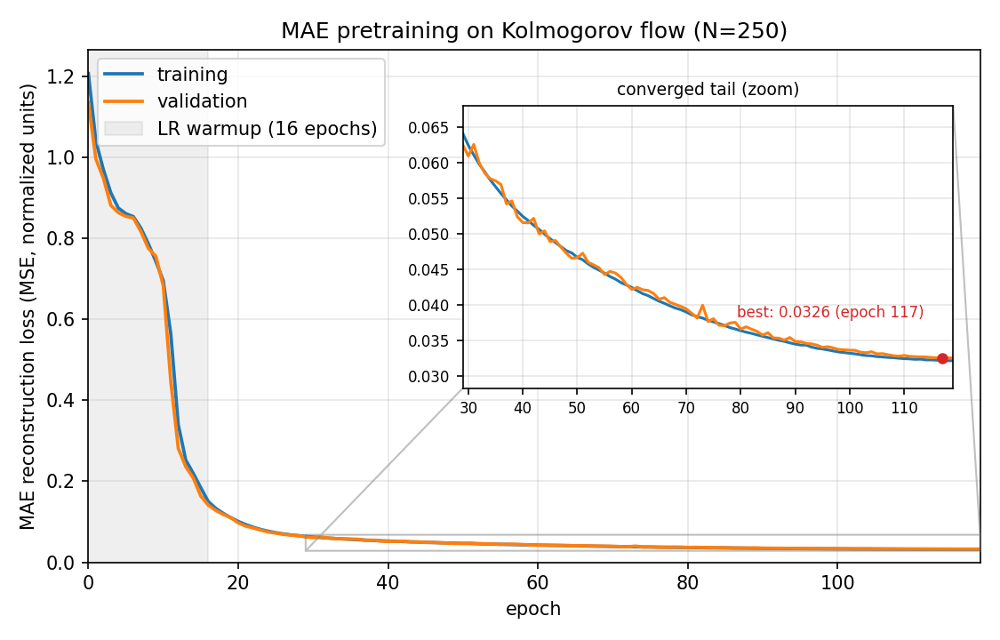
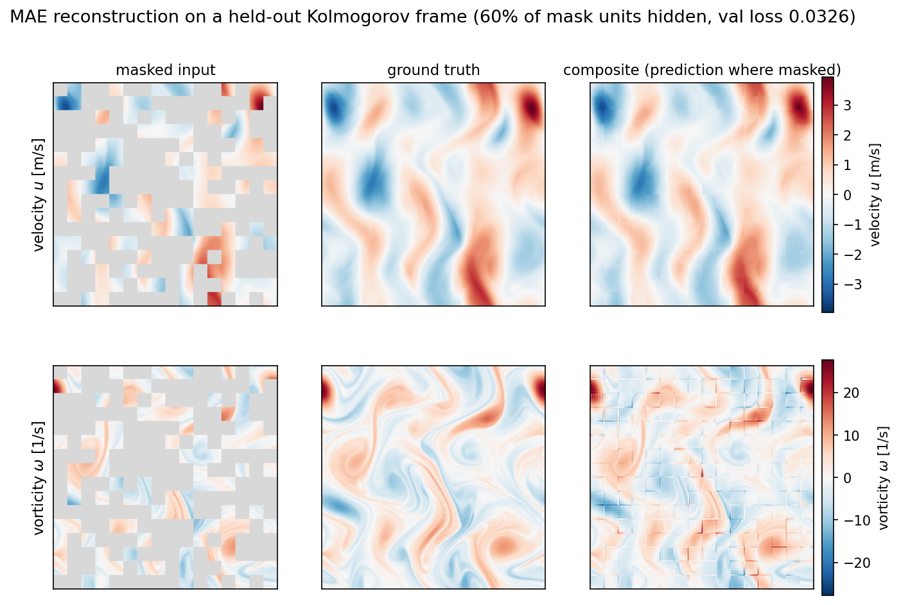

# hiera-2d

A minimal from-scratch reimplementation of [Hiera](https://github.com/facebookresearch/hiera) in 2D, with MAE
pretraining and an autoregressive next-frame head for neural PDE surrogates. The main experiment asks whether MAE
pretraining helps downstream autoregressive rollout on 2D Kolmogorov flow, and how the answer depends on training
set size: MAE-pretrained-then-finetuned vs. trained-from-scratch, at data budgets of N = 50, 100, and 250
trajectories.

The short answer: at a fixed finetuning budget, MAE pretraining improves rollout accuracy, and the advantage grows
with both the amount of data and the rollout horizon. It is roughly neutral at N=50 and a clear win by N=250.
Spectrally, the pretrained model injects less spurious high-wavenumber energy over long rollouts, most visibly at
larger N. So this is a fixed-budget, convergence-speed benefit rather than the "helps most when data is scarce"
sample-efficiency effect originally hypothesized. All comparisons are reported with bootstrap 95% confidence
intervals and paired significance tests over the full validation set.

## Requirements

- Python `>=3.12,<3.13`
- A CUDA GPU. Developed on an 8 GB NVIDIA RTX 2070 SUPER (CUDA 13). Both PyTorch (training) and JAX (data
  generation, via [`exponax`](https://github.com/Ceyron/exponax)) use the GPU.
- ~30 GB free disk for the dataset and ~26 GB host RAM for the largest training budget (see
  [Memory notes](#memory-notes)).

## Installation

We use [uv](https://docs.astral.sh/uv/); the lockfile (`uv.lock`) pins exact versions:

```bash
uv sync
```

## Repository layout

```
src/hiera_2d/
  hiera/            # Hiera encoder (model.py) + MAE decoder (mae.py), reimplemented from scratch
  experiments/
    data.py         # Kolmogorov dataset loading, train/val split, lazy val
    mae/            # MAE pretraining trainer + reconstruction visualization
    ar/             # autoregressive next-frame head, pushforward training, rollout
    scaling/        # data-scaling sweep driver (run_scaling.py) + typed config
  analysis/         # scaling_curve.py, spectral_plot.py, autocorrelation.py, loss_curve.py, spectra.py
  scripts/          # dg-kolmogorov generator, eval-rollout, compare-rollout
configs/            # hiera/*.toml, mae/*.toml, ar/*.toml (architectures) + scaling/*.toml (experiments)
```

## Configuration

There are two layers of configuration.

Architectures are small TOML configs, with schemas next to the code:

- Hiera encoder: [`hiera/model.py`](src/hiera_2d/hiera/model.py) (`HieraConfig`); see `configs/hiera/*.toml`.
- MAE decoder: [`hiera/mae.py`](src/hiera_2d/hiera/mae.py) (`MAEConfig`); see `configs/mae/*.toml`.
- AR head: [`experiments/ar/model.py`](src/hiera_2d/experiments/ar/model.py) (`ARHeadConfig`); see `configs/ar/*.toml`.

Experiments are a single commented TOML file; see [`configs/scaling/kg_scaling.toml`](configs/scaling/kg_scaling.toml).
It holds the dataset, the architecture-config paths, and the `[mae]`/`[ar]` hyperparameter blocks, so hyperparameters
live in one place rather than being duplicated across schemas or plumbed through CLI strings. Every script reads it
through the same `load_experiment_config` loader. Only the per-run identity (`--n-trajectories`, output dir, name,
encoder source, epoch override) travels on the CLI.

## Data

### Availability

The datasets are large (`kolmogorov2d_256_variedRe.h5` is ~28 GB) and are not checked into the repository
(`*.h5` is gitignored). They are fully regenerated by the deterministic command below: seeds `0…num_seeds-1` are
fixed, so re-running reproduces the same file, barring the stochastic timestep-refinement of a few diverging
trajectories, which does not change the saved-frame spacing. The exact file used for the reported results is
`kolmogorov2d_256_variedRe.h5`, produced by the canonical command in the next section.

### Generating the Kolmogorov dataset

A single flat HDF5 file holds a diverse Kolmogorov-flow family; the train/val split happens later, at load time in
`KolmogorovDataset`. Each trajectory gets its own Reynolds number (round-robin over `--n-re-values` points evenly
spaced across `[--re-min, --re-max]`) and its own burn-in (uniform in `[--burn-min, --burn-max]`), stored
per-trajectory in the `re`/`burn_time` datasets. `--keep-every` is the number of solver steps between saved frames,
so the saved spacing is `dt × keep-every`:

```bash
# canonical dataset (~28 GB, ~2 h on an 8 GB GPU)
uv run dg-kolmogorov --grid-size 256 --re-min 3000 --re-max 5000 --n-re-values 20 \
    --dt 5e-4 --num-seeds 625 --collect 100 --keep-every 200 \
    --burn-min 20 --burn-max 40 -o kolmogorov2d_256_variedRe.h5
```

At 625 seeds and the load-time `train_frac=0.8`, this yields exactly 500 train / 125 validation trajectories,
each 100 frames of 2-channel (u, v) velocity at 256×256, saved 0.1 s apart.

Near the CFL limit, whether a trajectory diverges depends on its own vorticity extrema, so divergence is stochastic
and selects for the most energetic trajectories. Discarding those would censor the high-wavenumber tail of the
dataset's spectrum, so instead a diverged trajectory is retried at half the timestep with `keep-every` doubled,
up to `MAX_HALVINGS` times, after which the run aborts. The saved-frame spacing is therefore identical for every
trajectory regardless of refinement; the timestep each one actually used is recorded in the `solver_dt` dataset.

> The generator sets `XLA_PYTHON_CLIENT_PREALLOCATE=false` before importing JAX: JAX otherwise preallocates ~75 % of
> VRAM, which starves cuFFT plan creation on an 8 GB card (`CUFFT_INTERNAL_ERROR`). `Ctrl+C` aborts and deletes the
> incomplete file.

## Reproducing the results

The full pipeline is three stages: generate, sweep, analyze. All figures are written under `outputs/kg_scaling/`.

### 1. Generate the dataset

Use the canonical `dg-kolmogorov` command [above](#generating-the-kolmogorov-dataset).

### 2. Run the data-scaling sweep

`run-scaling` expands a config into the whole matrix. For each N it runs an MAE pretrain, an AR finetune off it,
and an AR from-scratch baseline, each in a fresh spawned process so GPU memory is fully released between runs. Any
run whose `best_model.pt` already exists is skipped, so the sweep resumes idempotently. Run both protocols; the
second reuses the shared MAE + finetune arms and only trains the equal-epoch scratch baselines:

```bash
uv run run-scaling configs/scaling/kg_scaling.toml --dry-run   # inspect the plan first
uv run run-scaling configs/scaling/kg_scaling.toml             # handicap protocol: scratch gets 1.5x epochs
uv run run-scaling configs/scaling/kg_scaling_3030.toml        # equal-epoch (30/30) control
```

The two protocols differ only in `scratch_epoch_mult` (1.5 → `scratch_e45`, 1.0 → `scratch_e30`); run directories are
epoch-suffixed (`mae_e120`, `finetune_e30`, `scratch_e45`/`scratch_e30`) so both coexist under one `output_root`.

### 3. Produce the figures and tables

Scaling curves and the improvement table (finetune vs. scratch rollout MSE across N, bootstrapped with 95 % CIs and
paired significance). `--n-steps` sets the rollout horizon; report the medium horizons, since the full 99-step
horizon is dominated by chaotic blow-up:

```bash
for H in 5 10 40; do
  uv run scaling-curve configs/scaling/kg_scaling.toml      --n-steps $H -o outputs/kg_scaling/analysis_h$H
  uv run scaling-curve configs/scaling/kg_scaling_3030.toml --n-steps $H -o outputs/kg_scaling/analysis_3030_h$H
done
# each writes scaling_curve.png + scaling_report.json (means, CIs, paired diff, significance)
```

Log-log power spectra (ground truth vs. finetune vs. scratch, per N). The script writes `spectrum_loglog.png`;
rename per N:

```bash
for N in 50 100 250; do
  uv run spectral-plot configs/scaling/kg_scaling_3030.toml --n $N -o outputs/kg_scaling/analysis_3030_spectral
  mv outputs/kg_scaling/analysis_3030_spectral/spectrum_loglog.png \
     outputs/kg_scaling/analysis_3030_spectral/spectrum_N$N.png
done
```

Autocorrelation / iid diagnostic, a property of the data itself; reports the 1/e decorrelation time:

```bash
uv run autocorrelation --data-path kolmogorov2d_256_variedRe.h5 --delta-t 0.1 -o outputs/analysis_autocorr
```

MAE pretraining figures, i.e. the loss curve and a labelled reconstruction panel:

```bash
uv run loss-curve outputs/kg_scaling/N250/mae_e120 -o outputs/analysis_loss
uv run recon-figure --checkpoint outputs/kg_scaling/N250/mae_e120/checkpoints/best_model.pt \
    --sample 0 -o outputs/analysis_recon
```

`loss-curve` reads the run's TensorBoard event file and plots linear axes with the converged tail as an
inset; a log axis flattens an MAE loss into a featureless line. `recon-figure` renders ground truth /
masked input / prediction / composite for both the predicted velocity and its vorticity.

### Single-pair qualitative inspection (optional)

For a single checkpoint or pair (rollout GIF, per-model spectrum), the older `eval-rollout` / `compare-rollout`
scripts still work:

```bash
uv run eval-rollout --checkpoint outputs/kg_scaling/N250/finetune_e30/checkpoints/best_model.pt \
    --data-path kolmogorov2d_256_variedRe.h5 --dataset kolmogorov --n-steps 40 -o outputs/eval/n250_finetune
```

## Individual training runs

The sweep driver is the normal entry point, but the two trainers can be run directly, e.g. to reproduce one arm:

```bash
# MAE pretraining
uv run train-mae configs/scaling/kg_scaling.toml \
    --n-trajectories 250 -o outputs/kg_scaling/N250 --name mae_e120

# AR finetune off an MAE checkpoint (the "pretrained" condition)
uv run train-ar configs/scaling/kg_scaling.toml \
    --n-trajectories 250 -o outputs/kg_scaling/N250 --name finetune_e30 \
    --mae-checkpoint outputs/kg_scaling/N250/mae_e120/checkpoints/best_model.pt

# AR from scratch (same architecture, random init; the baseline). --n-epochs overrides the config budget.
uv run train-ar configs/scaling/kg_scaling.toml \
    --n-trajectories 250 -o outputs/kg_scaling/N250 --name scratch_e45 --n-epochs 45
```

Each run directory contains `args.json`, TensorBoard logs, and `checkpoints/` (`best_model.pt` records the epoch
budget as provenance). The rationale for the two epoch protocols is documented in the comments of
[`configs/scaling/kg_scaling.toml`](configs/scaling/kg_scaling.toml) and `kg_scaling_3030.toml`.

## Memory notes

Training eager-loads the N-trajectory train subset plus all 125 validation trajectories. Validation is loaded
lazily (one trajectory at a time) so RAM scales with N: N=250 fits comfortably alongside a desktop session,
but N=500 needs the full ~26 GB train set resident and may require freeing host RAM (e.g. a TTY session). The
analysis scripts stream one trajectory at a time and stay under ~1.5 GB.

## Quality checks

```bash
uv run ruff check src
```

## Examples

MAE reconstruction on a Kolmogorov validation frame (60 % masking) and the pretraining loss curve:



