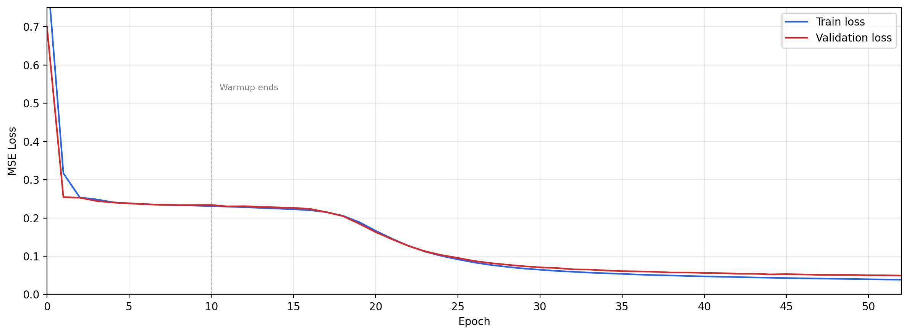
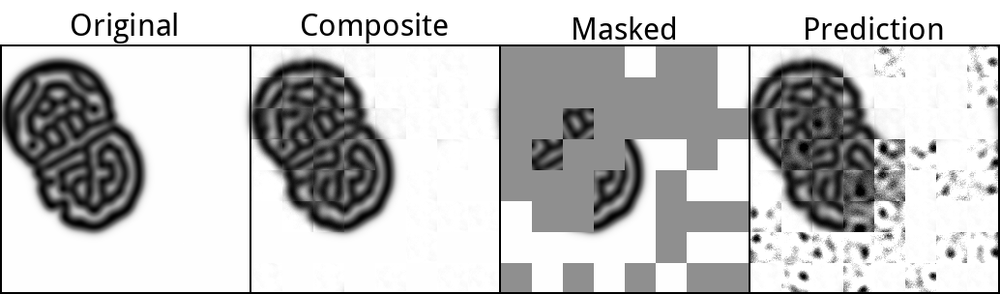

# hiera-2d

A minimal from scratch reimplementation of [Hiera](https://github.com/facebookresearch/hiera) in 2D along with MAE pretraining functionality and config system.

## Installation

We recommend [uv](https://docs.astral.sh/uv/) to run this project. Install and then simply run:
```bash
uv sync
```

## Configuration

Training is configured via two JSON files:

- A **Hiera config** which defines the encoder architecture. The schema can be found in [`model.py`](src/pw_hiera/hiera/model.py).
- A **MAE config** which defines the decoder architecture for the pretraining pipeline. The schema can be found in [`mae.py`](src/pw_hiera/hiera/mae.py)

We provide one config for each which was used to pretrain on Gray-Scott, which is currently the only tested and supported dataset ([`data.py`](src/pw_hiera/experiments/data.py))

## Usage

Run MAE pretraining:

```bash
uv run train-mae \
    --mae-config configs/mae/basic.json \
    --hiera-config configs/hiera/tiny.json \
    --data-path training/data/gray_scott \
    --batch-size 32 \
    --n-epochs 200 \
    --n-warmup-epochs 10 \
    --lr 0.0005 \
    --min-lr 0.000001 \
    --weight-decay 0.05 \
    --mask-ratio 0.6 \
    --seed 42 \
    --output-dir runs \
    --name gs_hiera_tiny
```

---

## Examples

Results from MAE pretraining on 2-channel [Gray-Scott](https://en.wikipedia.org/wiki/Reaction%E2%80%93diffusion_system) reaction-diffusion simulation data (256x256). The model (Hiera-Tiny, 24 blocks, d_embed=96) was trained for 400 epochs with a 60% mask ratio, batch size 32, and cosine-annealed learning rate (1.5e-4 to 1e-6) with 40 warmup epochs.

### Loss Curve



### Reconstruction Sample


